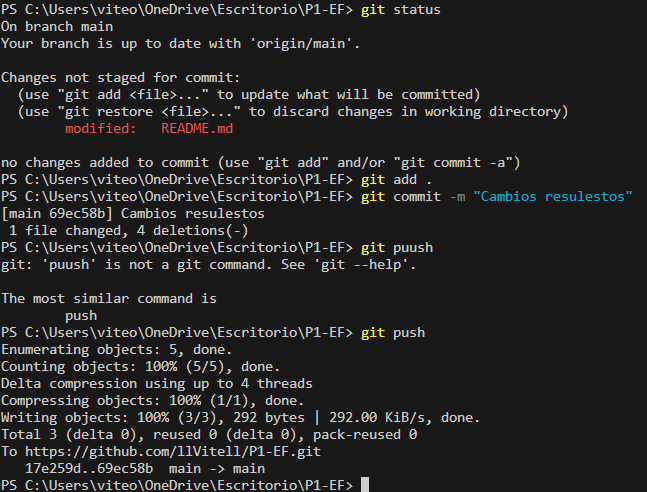

# PARTE 1

***
## Pregunta

Produce un conflicto de fusión (merge) en algún repositorio de tus actividades realizadas. Establece los pasos y comandos que usas para resolver un conflicto de fusión en Git

## Respuesta

1. Para realizar el conflicto de fusión primero creo un repositorio nuevo con un readme por defect, luego realizo un git clone y hago cambios de manera local sin hacer push ni commit, después hago cambios en el repositorio desde github para simular el avance de un compañero. Una vez hecho esto recién hago un push para que se genere el conflicto

**Pasos**

- Creacion de repositorio con readme por defecto


- Git clone + cambios locales


- Cambios desde el mismo github


- Conflicto al hacer push (`failed to push some refs`)


2. Para solucionar este conflicto primero realizamos un git pull, luego el mismo git nos dirá qué versiones podemos aceptar si la que teniamos localmente, la que está en el github o ambos

**Pasos**

1. Realizamos el git pull


2. Escogemos que version quedarnos


3. Ahora con el conflicto resuelto ya podemos hacer push



4. Se visualiza que tenemos el mismo resultado ya sea en local como en el github


***

## Pregunta

Digamos que nos dan el modelo de User de la siguiente manera: 

```Ruby
class User < ActiveRecord::Base
    validates :username, :presence => true
    validate :username_format
end
```

El primer validates actua sobre la campo username. Un objeto User no será válido sin un atributo username. 

**1. ¿Qué pasa si tenemos @user sin nombre de usuario y llamamos a @user.valid? ¿Qué guardará @user.save**

**2. Implementa username_format. Para los propósitos, un nombre de usuario comienza con una letra y tiene como máximo 10 caracteres de largo. Recuerda, las validaciones personalizadas agregan un mensaje a la colección de errores.**

## Respuesta

1. Si tenemos un objeto User sin un atributo username y llamamos a @user.valid, el método devolverá false. Esto se debe a que la validación de presencia falla, ya que el atributo username es obligatorio y si llamamos a @user.save, el método no guardará el objeto User en la base de datos. Esto se debe a que el objeto no es válido.

2.  Definimos el método username_format de la siguiente manera


El código verifica si el atributo username es nil, si no comienza con una letra o si tiene más de 10 caracteres de largo. Si alguna de estas condiciones es verdadera, el método agrega un mensaje de error a la colección de errores.

***

## Pregunta

Para el modelo de User, digamos que queremos verificar si @user era administrador de todos los métodos en AdminController. Completa el método before_filter:check_admin a continuación que verifica si el campo de administrador en @user es verdadero. De lo contrario, redirija a la página admin_login con un mensaje que indica acceso restringido.

## Respuesta

Primero definimos el método check_admin que se va a ejecutar antes del filtro. Este método se va a encargar de verificar si el usuario que está intentando ingresar es administrador o no, en caso no lo sea lo redirigirá a una vista.


***

## Pregunta

Comprueba si la combinación de nombre de usuario y contraseña funciona junto con la cuenta, si la hay. Para hacer eso, queremos que se realice una solicitud HTTP POST cuando se envíe este formulario. Escribe tu solución con jQuery y comenta dónde debe ubicarse la función de devolución de llamada (callback). Comprueba tus resultados.

```Html
<form method="POST" id="foo">
<input type="text" class="user" />
<input type="password" class="pass" />
<input type="button" value="Log␣in" id="onSubmit" />
</form>
```

## Respuesta

Para realizar la solicitud HTTP POST modificamos el evento onSubmit el cual se ejecuta al hacerle click al boton para enviar la información del formulario. Cuando hacemos click se ejecuta la función de devolución de llamada, esta devolución obtiene los valores de los campos de entrada del formulario y luego envía una solicitud POST a la dirección /login, la solicitud incluye los valores que ingresamos como datos y se ejecuta al completarse la solicitud.

Así se vería nuestro código


Ahora para poder visualizar nuestro resultado debemos guardar el código javascript en el fichero app/javascript de tal manera que podamos importarlo en la vista del formulario y así se implementaría

- Modificamos la vista añadiendo `<%= javascript_include_tag 'submit_event' %>` donde submit_event es el js que estamos implementando


- Y así se ve en el browser con el código javascript implementado


***


## Pregunta

¿Cuándo deberías utilizar la metaprogramación basada en eval en lugar de la metaprogramación basada en bloques?.

## Respuesta

La metaprogramación basada en eval es una técnica que permite modificar el comportamiento de Ruby en tiempo de ejecución. Se utiliza para crear nuevas clases, métodos, módulos y otros objetos.

La metaprogramación basada en bloques es una técnica similar solo que utiliza bloques para modificar el comportamiento del código. Es más segura y fácil de usar que la metaprogramación basada en eval, pero no es tan potente.

Por ende debería utilizar la metaprogramación basada en eval cuando requiera de modificaciones realmente complejas y la metaprogramación basada en bloques para tareas "sencillas" como añadir un método a una clase o modificarlos

***

# PARTE 2: PRUEBAS

Antes de empezar esta parte primero añadimos la gema faraday en nuestro archivo gemfile así como un controlador de test de rails y rspec.


***

## Paso 1: Escribiendo una nueva vista

Como primer paso, ampliarás RottenPotatoes con un formulario que permita al usuario buscar en The Open Movie Database (TMDb) una película para agregar a RottenPotatoes. 


***

